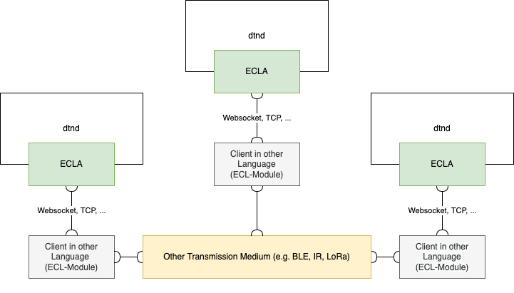
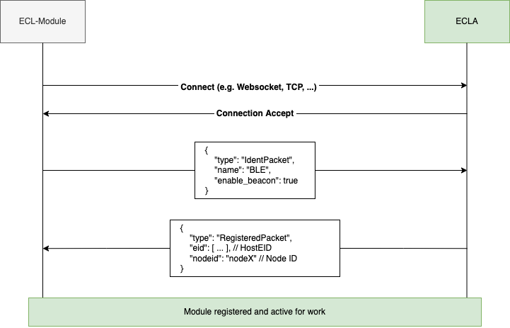
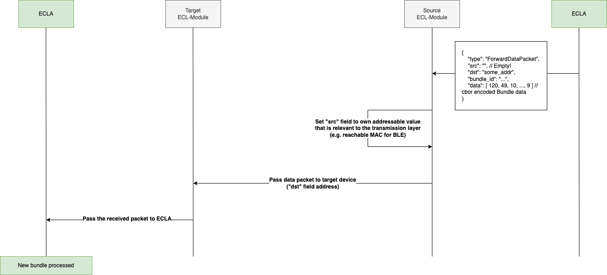

# ECLA



The External Convergence Layer Agent allows implementing Convergence Layer Agents externally (e.g. outside the dtn7-rs codebase). It works by exposing a realtime JSON API via WebSocket or TCP. With the help of the ECLA it is possible to easily implement new transmission layers in different language. All languages that can encode / decode JSON and communicate via WebSocket or TCP should in theory work. Additionally, the ECLA contains a optional and simple beacon system that can be used for peer discovery.


A client that connects to the ECLA and implements a new transmission layer is called a External Convergence Layer Module (in short ECL-Module).

## Protocol

### Packets & Encoding

All packets are JSON encoded and contain a field called ``type`` which specifies (as the name implies) the type of the packet. The protocol is compact and contains only 5 different packet types:

#### RegisterPacket

```json
{
  "type": "RegisterPacket",
  "name": "CLA Name",
  "enable_beacon": true
}
```

#### ErrorPacket

```json
{
  "type": "ErrorPacket",
  "reason": "error text"
}
```

#### RegisteredPacket

```json
{
  "type": "RegisteredPacket",
  "eid": [],
  "nodeid": "nodex"
}
```

#### ForwardDataPacket

```json
{
  "type": "ForwardDataPacket",
  "src": "...",
  "dst": "...",
  "bundle_id": "...",
  "data": "aGVsbG8...gd29ybGQ="
}
```

#### BeaconPacket

```json
{
  "type": "Beacon",
  "eid": [],
  "addr": "...",
  "service_block": "aGVsbG8...gd29ybGQ="
}
```

### Registration

After the initial connect to the ECLA the first packet that must be send is the ``RegisterPacket`` that contains the name of the CLA and if the beacon system should be enabled. If the registration is successful the ECLA responds with a ``RegisteredPacket`` containing basic information about the connected dtnd node. If a error occured a ``ErrorPacket`` will be returned. Reasons for error can be:
- CLA with the same name is already registered
- Illegal name (e.g. empty)

#### Example Sequence



### Forward Data

``ForwardDataPacket`` contains bundle data. You can either receive this packet from the dtnd that the ECL-Module is connected to or from the transmission layer that the module implements.

#### Coming from dtnd

If you receive the packet from the dtnd that means the ECL-Module should send the packet to the address specified in ``dst`` field. If no ``dst`` is specified, for example when the transmission layer doesn't have addressable id's send the packet to all possible targets. In case the transmission layer has addressable id's you must set the ``src`` field to the address of the ECL-Module.

#### Coming from the Transmission Layer

If you receive a packet from the transmission layer you must pass it to the ECLA as it is.

#### Example Sequence



### Beacon

## ECLA Rust WebSocket Client