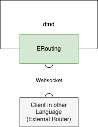
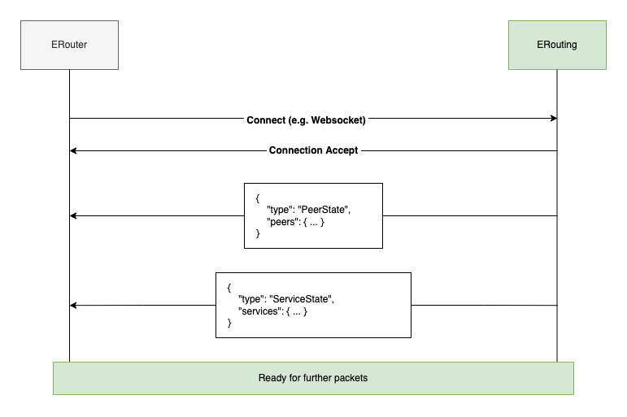

# External Routing



The External Routing allows implementing routing algorithms externally (e.g. outside the dtn7-rs codebase). It works by exposing a realtime JSON API via WebSocket. With the help of the erouting it is possible to easily implement new routing algorithms in different language. All languages that can encode / decode JSON and communicate via WebSocket should in theory work.

## Arguments

To enable the erouting use ``-r external`` as a routing algorithm.

## WebSocket Transport Layer

The WebSocket is accessible under the same port as defined by ``-w``, ``--web-port`` and the route ``/ws/erouting``. A Example for a web port 3000 would be ``127.0.0.1:3000/ws/erouting``.

## Connection Sequence

Connecting is only possible if no other external router is already connected. If a connection is successful the ERouting will start by sending an initial ``PeerState`` and ``ServiceState`` packet. After that ``SenderForBundle`` and other Packets can be received or send.



## Protocol

### Packets & Encoding

All packets are JSON encoded and contain a field called ``type`` which specifies (as the name implies) the type of the packet.

### From dtdn

#### Packet SenderForBundle

dtnd → external

The ``SenderForBundle`` is the most important packet. It specifies that a bundle wants to be sent by ``dtnd`` and senders that it can be forwarded to are wanted from your router.

- ``clas``: The registered clas at the time of the request
- ``bp``: The bundle pack containing information about the bundle

```json
{
  "type": "SenderForBundle",
  "clas": ["mtcp", "lora"],
  "bp": { ... }
}
```

#### Packet SendingFailed

dtnd → external

The ``SendingFailed`` is emitted when the sending of a bundle failed.

```json
{
  "type": "SendingFailed",
  "bid": "bundle_id",
  "cla_sender": "cla_name"
}
```

#### Packet Timeout

dtnd → external

The ``Timeout`` is emitted when no ``SenderForBundleReponse`` was recieved or the timeout (250ms) ran out.

```json
{
  "type": "Timeout",
  "bp": { ... }
}
```

#### Packet IncomingBundle

dtnd → external

The ``IncomingBundle`` is emitted when a bundle is incoming.

```json
{
  "type": "IncomingBundle",
  "bundle": { ... }
}
```

#### Packet IncomingBundleWithoutPreviousNode

dtnd → external

The ``IncomingBundleWithoutPreviousNode`` is emitted when a bundle is incoming with a previous node.

```json
{
  "type": "IncomingBundleWithoutPreviousNode",
  "bid": "bundle_id",
  "node_name": "nodex"
}
```

#### Packet EncounteredPeer

dtnd → external

The ``EncounteredPeer`` is a signal that a new peer is encountered.

```json
{
  "type": "EncounteredPeer",
  "name": "nodex",
  "eid": [ ... ],
  "peer": { ... }
}
```

#### Packet DroppedPeer

dtnd → external

The ``DroppedPeer`` is a signal that a peer was dropped.

```json
{
  "type": "DroppedPeer",
  "name": "nodex",
  "eid": [ ... ]
}
```

#### Packet PeerState

dtnd → external

The ``PeerState`` is the initial state of the peers.

```json
{
  "type": "PeerState",
  "peers": {
    "peer_addr_x": { ... },
    "peer_addr_y": { ... },
    "peer_addr_z": { ... },
    ...
  }
}
```

#### Packet ServiceState

dtnd → external

The ``ServiceState`` is the initial state of the peers.

```json
{
  "type": "ServiceState",
  "services": {
    "tag": "name",
    ...
  }
}
```

### From external

#### Packet AddService

external → dtnd

The ``AddService`` packet can be sent to register a service.

```json
{
  "type": "AddService",
  "tag": 10,
  "service": "name"
}
```

#### Packet SenderForBundleResponse

external → dtnd

The ``SenderForBundleResponse`` as the name suggests is the response to a ``SenderForBundle`` packet by your router.

- ``bp``: The original bundle pack of the request
- ``clas``: List of applicable senders each containing:
  - ``remote``: The remote address
  - ``port``(optional): Port for the CLA
  - ``agent``: Name of the CLA

```json
{
  "type": "SenderForBundleResponse",
  "bp": { ... },
  "clas": [
    {
      "remote": { ... },
      "port": 1837,
      "agent": "mtcp"
    },
    ...
  ]
}
```

## Implementing a routing strategy

In order to implement a basic routing strategy you most likely want to do the following
- Connect to the WebSocket
- Keep track of the peers by:
  - Saving the initial ``PeerState``
  - Adding peer if ``PeerEncountered`` packet is received
  - Removing peer ``PeerDropped`` packet is received
- Responding to ``SenderForBundle`` packet with a ``SenderForBundleResponse`` packet based on some kind of strategy and most likely involving the available peers.

## Python Example: Direct Routing

The example shows how you can implement a direct routing strategy in python. Direct routing means that a bundle is only passed if the target peer is directly connected to the current node.

```python
import websocket
import json

# Minimal example for external routing with a direct routing strategy.
#
# Requirements:
# pip3 install websocket-client

# Dict of available peers
peers = {}

# Dict of delivered bundles
delivered = {}


# Extract node name from [1, "//nodex/..."]
def get_node_from_endpoint(endpoint):
    url = endpoint[1][2:]
    return url[:url.index("/")]


#
# Base WebSocket Handler
#


def on_open(ws):
    print("Connected")


def on_message(ws, raw):
    print(raw)

    msg = json.loads(raw)

    switcher = {
        "SenderForBundle": on_sender_for_bundle,
        "PeerState": on_peer_state,
        "PeerEncountered": on_peer_encountered,
        "PeerDropped": on_peer_dropped,
        "SendingFailed": on_sending_failed,
    }

    switcher.get(msg["type"])(msg)


#
# Packet Handlers
#


def on_sender_for_bundle(msg):
    dest = msg["bp"]["destination"]
    bundle_id = msg["bp"]["id"]

    print("===> SenderForBundle: To", dest[1], bundle_id)

    # Check if already delivered
    global delivered
    if bundle_id in delivered:
        print("Bundle was already delivered!")
        return

    # Check if peer is known
    target = peers.get(get_node_from_endpoint(dest))
    if target is not None:
        req_cla_list = msg['clas']
        peer_cla_list = target["cla_list"]
        target_clas = []

        # Search for possible clas
        for c in peer_cla_list:
            if req_cla_list.index(c[0]) >= 0:
                target_clas.append({
                    "remote": target["addr"],
                    "agent": c[0],
                    "port": c[1]
                })

        # Build and send response
        resp = {
            "type": "SenderForBundleResponse",
            "bp": msg["bp"],
            "clas": target_clas
        }

        # If some cla was found set as delivered
        if len(target_clas) > 0:
            delivered[bundle_id] = True
            print("Peer is known and sending is requested via", target_clas)
        else:
            print("Peer is known but no cla could be selected")

        # Send response
        wsapp.send(json.dumps(resp))
    else:
        print("Peer not directly known")


def on_peer_state(msg):
    print("===> PeerState")

    global peers
    peers = msg["peers"]


def on_peer_encountered(msg):
    print("===> PeerEncountered: Encountered", msg["name"])

    global peers
    peers[msg["name"]] = msg


def on_peer_dropped(msg):
    print("===> PeerDropped: Dropping", msg["name"])

    global peers
    del peers[msg["name"]]


def on_sending_failed(msg):
    print("===> SendingFailed: For Bundle", msg['bid'])

    # Remove from delivered if sending failed
    global delivered
    del delivered[msg['bid']]


#
# Start WebSocket Client
#


wsapp = websocket.WebSocketApp("ws://127.0.0.1:3002/ws/erouting", on_message=on_message, on_open=on_open)
wsapp.run_forever()
```